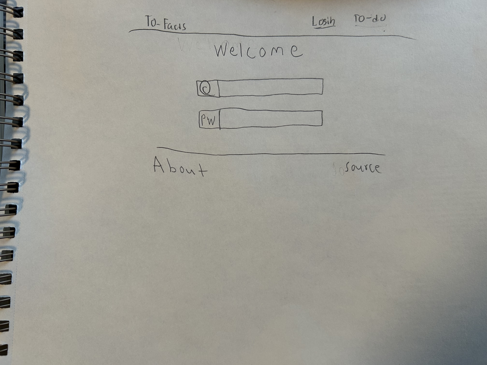
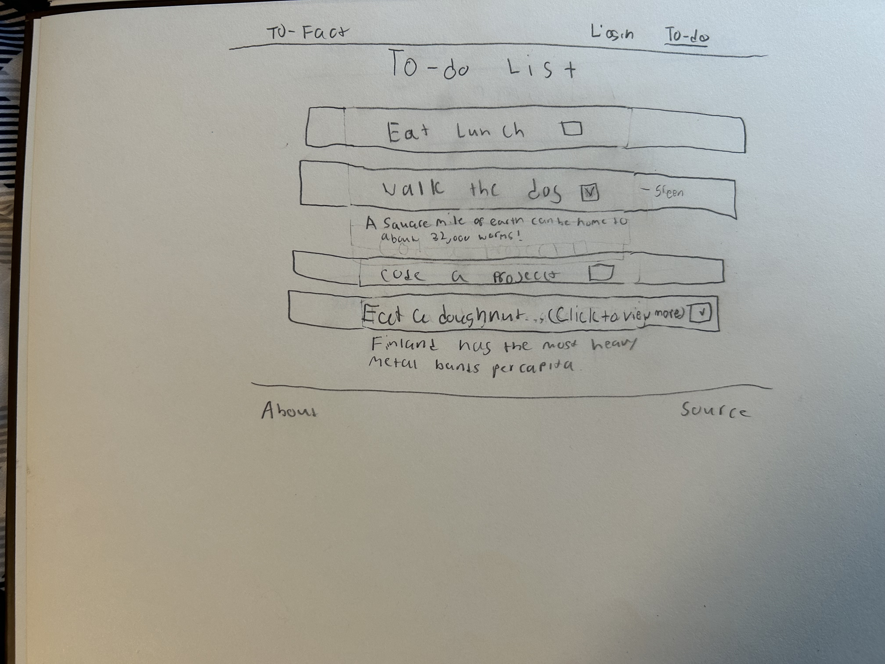
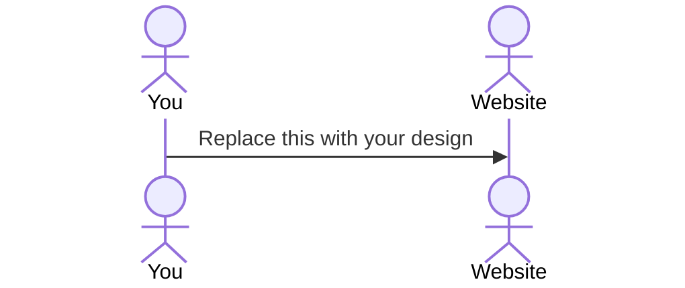

# To-Facts
<!--[My Notes](notes.md)-->

To-Facts is an application that gives unique, interesting facts pulled from the internet after the completion of a task. To-Facts helps users to be able to keep track of items on their to-do list while also helping motivate them to complete these items through a reward system that gives an interesting fact upon the completion of a task.  

## 🚀 Specification Deliverable

For this deliverable I did the following. I checked the box `[x]` and added a description for things I completed.

- `[x]` Proper use of Markdown
- `[x]` A concise and compelling elevator pitch
- `[x]` Description of key features
- `[x]` Description of how you will use each technology
- `[x]` One or more rough sketches of your application. Images must be embedded in this file using Markdown image references.

### Elevator pitch

Have you ever stared at a to-do list for minutes, even hours dreading the idea of having to do the tasks on the list. To-Facts makes doing items on a to-do list fun! It gives an interesting fact to a person after checking off a task. They can be funny, interesting, useful, or quirky facts. Doing items on your to-do list has never been so gratifying. To_Facts help you to stay on task and get things done, giving entertainment along the way with surprise facts!

### Design

### Login Page

### To-Do List Page

### Key features

- Features a list of to-do items associated with a user (Remains persistent and is updated)
- Features secure login over HTTPS
- Is responsive to the environment (Size changes with screen size)
- User has the ability to drag and drop tasks
- Implements a reward system that displays random facts pulled from the web upon task completion
- Ability to add and remove tasks, as well as to mark complete or incomplete

### Technologies

I am going to use the required technologies in the following ways.

- **HTML** - Proper HTML semantics used. There will be a login page for user authentication and a to-do list page for task management. 
- **CSS** - CSS takes on a responsive, user-friendly and professional appearance. Tasks in the list looks good as well as the buttons and the facts. Tasks styled as interactive blocks and will visually change states when completed.  
- **React** - Allows the app to be dynamic, allowing the user to interact with the app in real time and perform activities such as check and uncheck tasks. Ensures fetched data like facts/login are pulled from the backend to be used in the user interface. 
- **Service** - Backend service will manage API interactions including both third party API's and my own custom work. It will:  
  1. Grab fun facts from the external API.
  2. Process and return the data to the frontend.
  3. Have custom functions that manage to-do list operations such as adding and deleting tasks.
- **DB/Login** - Stores login data and updated to-do list data associated with the login. Secure and cannot be accessed unless logged in. Tasks are private and will not be visible to other users. <!--Also stores task completed data, also pushes the highest task completed ones to a leaderboard html page? -->
- **WebSocket** - Pushes updates to the frontend in real time. Includes syncing to-do list changes across different devices if the same user is logged in. <!--Also includes pushing fact updates to the frontend after task completion. --> Also allows user to compare amount of tasks completed with leaderboard data. <!--Ask if this is needed first. -->

<!--## 🚀 AWS deliverable

For this deliverable I did the following. I checked the box `[x]` and added a description for things I completed.

- [ ] **Server deployed and accessible with custom domain name** - [My server link](https://yourdomainnamehere.click).

## 🚀 HTML deliverable

For this deliverable I did the following. I checked the box `[x]` and added a description for things I completed.

- [ ] **HTML pages** - I did not complete this part of the deliverable.
- [ ] **Proper HTML element usage** - I did not complete this part of the deliverable.
- [ ] **Links** - I did not complete this part of the deliverable.
- [ ] **Text** - I did not complete this part of the deliverable.
- [ ] **3rd party API placeholder** - I did not complete this part of the deliverable.
- [ ] **Images** - I did not complete this part of the deliverable.
- [ ] **Login placeholder** - I did not complete this part of the deliverable.
- [ ] **DB data placeholder** - I did not complete this part of the deliverable.
- [ ] **WebSocket placeholder** - I did not complete this part of the deliverable.

## 🚀 CSS deliverable

For this deliverable I did the following. I checked the box `[x]` and added a description for things I completed.

- [ ] **Header, footer, and main content body** - I did not complete this part of the deliverable.
- [ ] **Navigation elements** - I did not complete this part of the deliverable.
- [ ] **Responsive to window resizing** - I did not complete this part of the deliverable.
- [ ] **Application elements** - I did not complete this part of the deliverable.
- [ ] **Application text content** - I did not complete this part of the deliverable.
- [ ] **Application images** - I did not complete this part of the deliverable.

## 🚀 React part 1: Routing deliverable

For this deliverable I did the following. I checked the box `[x]` and added a description for things I completed.

- [ ] **Bundled using Vite** - I did not complete this part of the deliverable.
- [ ] **Components** - I did not complete this part of the deliverable.
- [ ] **Router** - Routing between login and voting components.

## 🚀 React part 2: Reactivity

For this deliverable I did the following. I checked the box `[x]` and added a description for things I completed.

- [ ] **All functionality implemented or mocked out** - I did not complete this part of the deliverable.
- [ ] **Hooks** - I did not complete this part of the deliverable.

## 🚀 Service deliverable

For this deliverable I did the following. I checked the box `[x]` and added a description for things I completed.

- [ ] **Node.js/Express HTTP service** - I did not complete this part of the deliverable.
- [ ] **Static middleware for frontend** - I did not complete this part of the deliverable.
- [ ] **Calls to third party endpoints** - I did not complete this part of the deliverable.
- [ ] **Backend service endpoints** - I did not complete this part of the deliverable.
- [ ] **Frontend calls service endpoints** - I did not complete this part of the deliverable.

## 🚀 DB/Login deliverable

For this deliverable I did the following. I checked the box `[x]` and added a description for things I completed.

- [ ] **User registration** - I did not complete this part of the deliverable.
- [ ] **User login and logout** - I did not complete this part of the deliverable.
- [ ] **Stores data in MongoDB** - I did not complete this part of the deliverable.
- [ ] **Stores credentials in MongoDB** - I did not complete this part of the deliverable.
- [ ] **Restricts functionality based on authentication** - I did not complete this part of the deliverable.

## 🚀 WebSocket deliverable

For this deliverable I did the following. I checked the box `[x]` and added a description for things I completed.

- [ ] **Backend listens for WebSocket connection** - I did not complete this part of the deliverable.
- [ ] **Frontend makes WebSocket connection** - I did not complete this part of the deliverable.
- [ ] **Data sent over WebSocket connection** - I did not complete this part of the deliverable.
- [ ] **WebSocket data displayed** - I did not complete this part of the deliverable.
- [ ] **Application is fully functional** - I did not complete this part of the deliverable.-->

