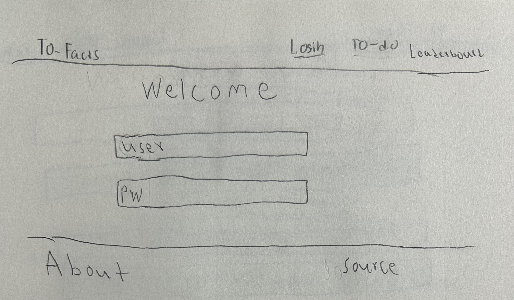
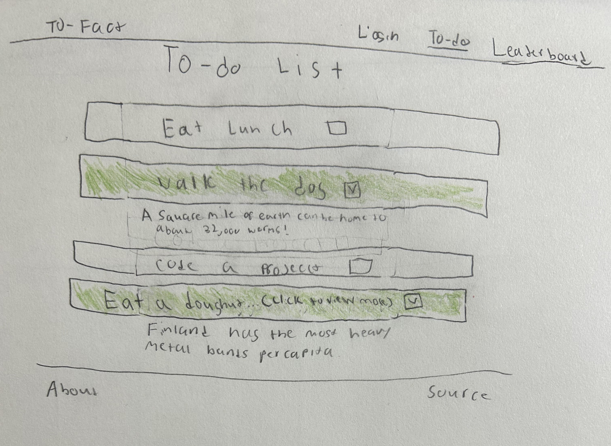
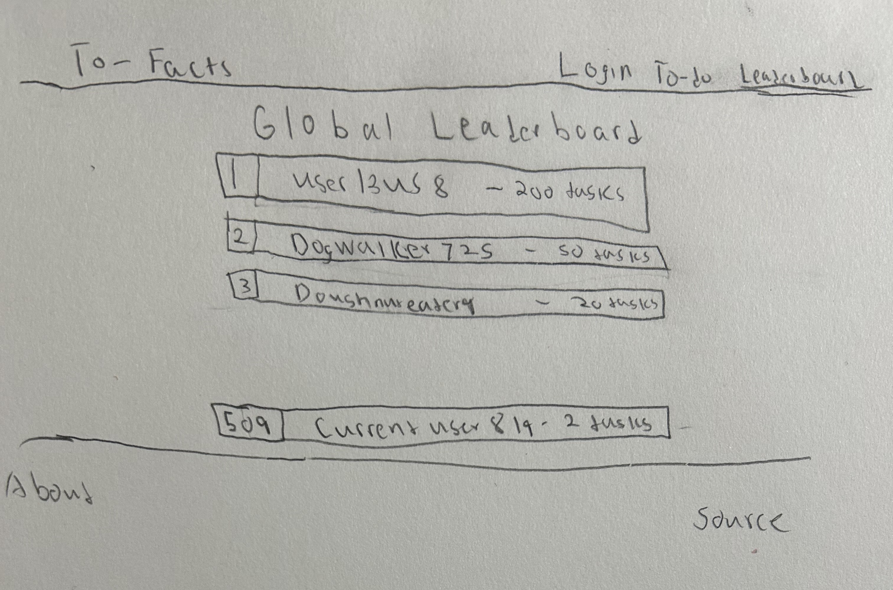

# To-Facts
<!--[My Notes](notes.md)

For the AWS Section. I learned a lot about how to set up a web server on the Amazon cloud. I learned that there are a lot of different types of domains. There are also a lot of rules you can use in the records sections which helps control the routing. This is somewhat similar to the redirects in WordPress. However it is a little bit different in that these rules can form the basis of the site and the site cannot always function without them. 

For the HTML section I learned a lot about using html to group components together, specifically making list like structuers. I learned that sometimes instead of using unordered lists or other actual list components its better to make div groups that are grouped together because it allows more functionality. I also learned a bit about HTML semantics. Such as sectioning div groups and other items and using nav around links.

For the CSS section I learned a lot about using styling to make HTML components pretty. I learned that there are certain subtle differences that can give you the results you need. Like setting height to 100vh expands the height to fill screen while setting it to 100% doesn't. (Which I guess makes sense since vh = view height) I also learned a lot about CSS components and using them to get results on the HTMl components that look good. 

For the React Part 1 I learned about using nav links to set up routing as a single page application. I also learned about establishing each HTML component as a React component I also learned a lot about modularization as well.

For React Part 2 I learned a lot about the syntax requirements (syntax errors/debugging took the most amount of time). I also learned a lot about the different components of a functional react app like use effect and use state.
in addition I felt like I learned a lot about JS functions and react specific functions as well. I felt like so far this part of the project has helped me to learn the most out of all of the parts. 

For Simon Service I felt like I learned a lot about working between the front and the backend. Once again the syntax errors and the debugging took a lot of time for me. I also felt like I learned a lot more about async code and await. Which was something that I was a little confused about before but I felt like I got a better hold of during this process. I also felt like I learned a bit about debugging code and writing better JS/react since this section was almost entirely made of JS.  

For the Database I felt like I learned a lot from it, particularly about how to establish the database connection with the service and how websites interact with a database to store information. I also felt like I learned a lot about how the importance of directly affecting objects vs making copies. I often unintentionally made copies and the database would not receive the updates if I updated the copies. 

For the Websocket I learned a lot about how the websocket instances work and how to implement them in the website. I learned a lot about using the development environment to examine data actively in the website. (I needed to do this to see if the WS was working.) I also learned a lot about debugging and stepping through code as I needed to debug the WS quite a bit to get it to work. This was defintely the most complex deliverable for me as there were a lot of steps, especially in getting the WS set up and getting it to connect.  
-->

To-Facts is an application that gives unique, interesting facts pulled from the internet after the completion of a task. To-Facts helps users to be able to keep track of items on their to-do list while also helping motivate them to complete these items through a reward system that gives an interesting fact upon the completion of a task.  

## 🚀 Specification Deliverable

For this deliverable I did the following. I checked the box `[x]` and added a description for things I completed.

- `[x]` Proper use of Markdown
- `[x]` A concise and compelling elevator pitch
- `[x]` Description of key features
- `[x]` Description of how you will use each technology
- `[x]` One or more rough sketches of your application. Images must be embedded in this file using Markdown image references.

### Elevator pitch

Have you ever stared at a to-do list for minutes, even hours dreading the idea of having to do the tasks on the list. To-Facts makes doing items on a to-do list fun! It gives an interesting fact to a person after checking off a task. They can be funny, interesting, useful, or quirky facts. Doing items on your to-do list has never been so gratifying. To_Facts help you to stay on task and get things done, giving entertainment along the way with surprise facts!

### Login Page

### To-Do List Page

### Leaderboard Page

### Key features

- Features a list of to-do items associated with a user (Remains persistent and is updated)
- Features secure login over HTTPS
- Is responsive to the environment (Size changes with screen size)
- User has the ability to drag and drop tasks
- Implements a reward system that displays random facts pulled from the web upon task completion
- Ability to add and remove tasks, as well as to mark complete or incomplete
- A live global leaderboard that displays number of tasks completed from all users
 

### Technologies

I am going to use the required technologies in the following ways.

- **HTML** - Proper HTML semantics used. There will be a login page for user authentication, a to-do list page for task management and a leaderboard page that displays live task completion data. 
- **CSS** - CSS takes on a responsive, user-friendly and professional appearance. Tasks in the list looks good as well as the buttons and the facts. Tasks styled as interactive blocks and will visually change states when completed.  Leaderboard positions will appear in neatly styled blocks as well.
- **React** - Allows the app to be dynamic, allowing the user to interact with the app in real time and perform activities such as check and uncheck tasks. Ensures fetched data like facts/login are pulled from the backend to be used in the user interface. 
- **Service** - Backend service will manage API interactions including both third party API's and my own custom work. It will:  
  1. Grab fun facts from the external API.
  2. Process and return the data to the frontend.
  3. Have custom functions that manage to-do list operations such as adding and deleting tasks.
- **DB/Login** - Stores login data and updated to-do list data associated with the login. Secure and cannot be accessed unless logged in. Tasks are private and will not be visible to other users. 
- **WebSocket** - Collects real-time data from all users and compiles them into a leaderboard which updates in real time as users complete tasks. 

 🚀 AWS deliverable

For this deliverable I did the following. I checked the box `[x]` and added a description for things I completed.

- `[x]` **Server deployed and accessible with custom domain name** - [My server link](https://todo-facts.click).

## 🚀 HTML deliverable

For this deliverable I did the following. I checked the box `[x]` and added a description for things I completed.

- [x ] **HTML pages** - I did complete this part of the deliverable. There are html pages for each component of the app. 
- [ x] **Proper HTML element usage** - I did complete this part of the deliverable. Each of the pages have proper HTML styling.
- [ x] **Links** - I did complete this part of the deliverable. Each of the pages use proper linking.
- [x ] **Text** - I did complete this part of the deliverable.
- [x ] **3rd party API placeholder** - I did complete this part of the deliverable. There is a 3rd party placeholder placed in the app (it's visible).
- [x ] **Images** - I did complete this part of the deliverable. There are images in the app, there is an image of the app being built in the about page and there are also images of medals used in the leaderboard section. 
- [ x] **Login placeholder** - I did complete this part of the deliverable. There is a login placeholder for when the login will be implemented. 
- [ x] **DB data placeholder** - I did complete this part of the deliverable. There is a DB placeholder for when the database will be implemented.
- [x ] **WebSocket placeholder** - I did complete this part of the deliverable. There is a websocket placeholder for when the database will be implemented.

## 🚀 CSS deliverable

For this deliverable I did the following. I checked the box `[x]` and added a description for things I completed.

- [x ] **Header, footer, and main content body** - I did complete this part of the deliverable. There are headers, footers, and main body contents for each of the html pages. 
- [x ] **Navigation elements** - I did complete this part of the deliverable. The pages each include navigational elements (specifically in the header especially)
- [x ] **Responsive to window resizing** - I did complete this part of the deliverable. The pages are responsive and adjust. 
- [x ] **Application elements** - I did complete this part of the deliverable. The application elements look appropriate and professional and have a decent appearance. All parts of the app have some CSS styling applied. 
- [x ] **Application text content** - I did complete this part of the deliverable. The text in the application have CSS applied to it as well. 
- [x ] **Application images** - I did complete this part of the deliverable. The images in the application have CSS applied to resize and make them fit the app better.

## 🚀 React part 1: Routing deliverable

For this deliverable I did the following. I checked the box `[x]` and added a description for things I completed.

- [ x ] **Bundled using Vite** - I did complete this part of the deliverable. The app uses Vite to bundle it and enable the "npm run dev" command. (Which I used a ton while developing it).
- [ x ] **Components** - I did complete this part of the deliverable. The components of the app which were previously in HTML format were moved to be in JS and react formatting. 
- [ x ] **Router** - Routing between login and voting components. The routing was set up for the app to be able to work properly.

## 🚀 React part 2: Reactivity

For this deliverable I did the following. I checked the box `[x]` and added a description for things I completed.

- [ x ] **All functionality implemented or mocked out** - I did complete this part of the deliverable. The app has proper functionality including the ability to add, check, remove, keep track of score, see fun facts appear (after checking tasks), (also updates score on leaderboard), login, and more minor features that were implemented as well such as the tasks appearing green on being checked. 
- [ x ] **Hooks** - I did complete this part of the deliverable. The app uses useState and useEffect to implement the features listed above.

## 🚀 Service deliverable

For this deliverable I did the following. I checked the box `[x]` and added a description for things I completed.

- [ x ] **Node.js/Express HTTP service** - I did complete this part of the deliverable. The site uses expresses for the backend. 
- [ x ] **Static middleware for frontend** - I did complete this part of the deliverable. The site uses middleware functions in the front end.
- [ x ] **Calls to third party endpoints** - I did complete this part of the deliverable. The site uses third party endpoints (specifically in the TaskItem.jsx file in the To-Do folder.) Calls to a fact api. 
- [ x ] **Backend service endpoints** - I did complete this part of the deliverable. Uses backend service endpoints to accomplish tasks in the site like logging in and authorization. 
- [ x ] **Frontend calls service endpoints** - I did complete this part of the deliverable. The frontend features fetches to the backend and uses those fetches appropriately to accomplish tasks like creating tasks and logging in. 
- [ x ] **Supports registration, login, logout, and restricted endpoint - I did complete this part of the deliverable. The site features restricted endpoints and registration, login and logout. 

## 🚀 DB/Login deliverable

For this deliverable I did the following. I checked the box `[x]` and added a description for things I completed.
- [ x ] **Stores data in MongoDB** - I did complete this part of the deliverable. Stores the tasks that belongs to each user as well as their completed state and the total score that the user has. 
- [ x ] **Stores credentials in MongoDB** - I did complete this part of the deliverable. Stores the token of the user and removes it when logged out. Also stores the hashed password and the username of the user. 

## 🚀 WebSocket deliverable

For this deliverable I did the following. I checked the box `[x]` and added a description for things I completed.

- [ x ] **Backend listens for WebSocket connection** - I did complete this part of the deliverable. The backend listens for the Websocket connection, it sets up the connection and listens for it successfully. 
- [ x ] **Frontend makes WebSocket connection** - I did complete this part of the deliverable. The network tab in the frontend (leaderboard page) shows pending which means the WS has made the connection and is listening for data. 
- [ x ] **Data sent over WebSocket connection** - I did complete this part of the deliverable. Data is sent over the connection. If you click on the network tab and the WS connection you can see what data.
- [ x ] **WebSocket data displayed** - I did complete this part of the deliverable. The data is used to update the leaderboard. It updates without needing to refresh, a property of WS. 
- [ x ] **Application is fully functional** - I did complete this part of the deliverable. The application works just as planned!
